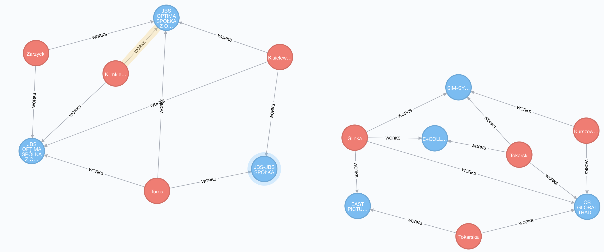
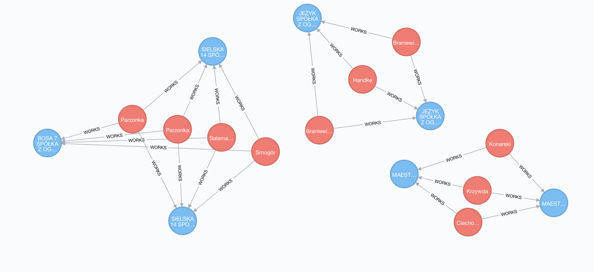
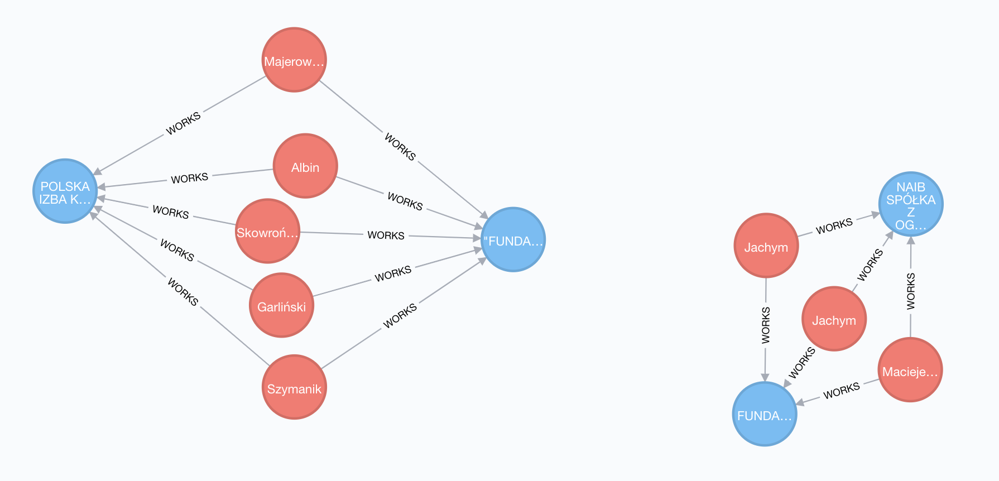

## ogólne
```
podmiotów: 667_746
osób: 1_321_652
relacji podmiot-osoba: 1_859_603
relacji osoba-osoba (osoby pracujące razem): 7_008_026
trójkątów w relacjach osoba-osoba: 21_473_393
clustering coefficient (osoba-osoba): 0.7539559040773499
transitivity: 0.785728389720979
```

#### trójkąty
```cypher
match f=((s:Subject)-[:WORKS*6]-(s)) return f limit 1000
```



## formy prawne

nazwa | id | ilość
-|-|-
brak danych | - | 1321652
SPÓŁKA Z OGRANICZONĄ ODPOWIEDZIALNOŚCIĄ | 14 | 423661
STOWARZYSZENIE | 15 | 80055
SPÓŁKA JAWNA | 11 | 42222
SPÓŁKA KOMANDYTOWA | 12 | 38728
FUNDACJA | 1 | 27682
SPÓŁDZIELNIA | 9 | 12686
SPÓŁKA AKCYJNA | 10 | 10639
ZWIĄZEK ZAWODOWY | 18 | 7191
SPÓŁKA KOMANDYTOWO-AKCYJNA | 32 | 6196
STOWARZYSZENIE KULTURY FIZYCZNEJ | 16 | 5455
KÓŁKO ROLNICZE | 5 | 3767
ODDZIAŁ ZAGRANICZNEGO PRZEDSIĘBIORCY | 6 | 3048
SAMODZIELNY PUBLICZNY ZAKŁAD OPIEKI ZDROWOTNEJ | 39 | 1418
ZWIĄZEK SPORTOWY | 20 | 621
ZWIĄZEK STOWARZYSZEŃ | 25 | 615
CECH RZEMIEŚLNICZY | 19 | 525
ZWIĄZEK PRACODAWCÓW | 17 | 477
ROLNICZE ZRZESZENIE BRANŻOWE | 8 | 467
INNA OSOBA PRAWNA BĘDĄCA ORGANIZACJĄ POŻYTKU PUBLICZNEGO | 35 | 439
IZBA GOSPODARCZA | 3 | 428
ZWIĄZKI ROLNIKÓW, KÓŁEK I ORGANIZACJI ROLNICZYCH | 22 | 327
STOWARZYSZENIE KULTURY FIZYCZNEJ O ZASIĘGU OGÓLNOKRAJOWYM | 23 | 187
INSTYTUT BADAWCZY | 2 | 118
PRZEDSIĘBIORSTWO PAŃSTWOWE | 7 | 79
POLSKI ZWIĄZEK SPORTOWY | 27 | 74
SPÓŁDZIELCZA KASA OSZCZĘDNOŚCIOWO-KREDYTOWA | 48 | 66
ZRZESZENIE HANDLU I USŁUG | 24 | 66
STOWARZYSZENIE OGRODOWE | 50 | 63
NIE POSIADAJĄCA OSOBOWOŚCI PRAWNEJ INSTYTUCJA KOŚCIELNA BĘDĄCA ORGANIZACJĄ POŻYTKU PUBLICZNEGO | 36 | 57
KOŚCIELNA OSOBA PRAWNA BĘDĄCA ORGANIZACJĄ POŻYTKU PUBLICZNEGO | 34 | 56
ZWIĄZEK ROLNICZYCH ZRZESZEŃ BRANŻOWYCH | 28 | 55
ZRZESZENIE TRANSPORTU | 26 | 50
IZBA RZEMIEŚLNICZA | 4 | 40
JEDNOSTKA TERENOWA STOWARZYSZENIA POSIADAJĄCA OSOBOWOŚĆ PRAWNĄ | 49 | 32
NIE POSIADAJĄCA OSOBOWOŚCI PRAWNEJ ORGANIZACJA POŻYTKU PUBLICZNEGO | 37 | 28
OGÓLNOKRAJOWY ZWIĄZEK MIĘDZYBRANŻOWY | 21 | 24
FEDERACJA / KONFEDERACJA ZWIĄZKÓW PRACODAWCÓW | 31 | 20
INSTYTUCJA GOSPODARKI BUDŻETOWEJ | 46 | 16
ZWIĄZEK ZAWODOWY ROLNIKÓW INDYWIDUALNYCH | 29 | 15
SPÓŁKA EUROPEJSKA | 38 | 13
TOWARZYSTWO UBEZPIECZEŃ WZAJEMNYCH | 42 | 11
JEDNOSTKA BADAWCZO-ROZWOJOWA | 40 | 11
OGÓLNOKRAJOWE ZRZESZENIE MIĘDZYBRANŻOWE | 30 | 9
JEDNOSTKA ORGANIZACYJNA ZWIĄZKU ZAWODOWEGO POSIADAJĄCA OSOBOWOŚĆ PRAWNĄ | 51 | 5
KOLUMNA TRANSPORTU SANITARNEGO | 41 | 1
OGÓLNOKRAJOWA REPREZENTACJA ZRZESZEŃ TRANSPORTU | 45 | 1
ZWIĄZEK RZEMIOSŁA POLSKIEGO | 43 | 1
OGÓLNOKRAJOWA REPREZENTACJA ZRZESZEŃ HANDLU I USŁUG | 33 | 1

## główne składowe

lp | id składowej | rozmiar | zawartość
-|-|-|-
1 | 505203 | 827362 | 249_013 podmiotów, 578_349 osób 962_906 relacji, 1587 osób powyżej 15 relacji, rozkład spółek jak w całym grafie
2 | 965404 | 308 | spółki Martina Langi i Bartosza Helda
3 | 1670862 | 252 | spółki Przemysława Borucha
4 | 1649953 | 224 | spółki Pawła Piecewicza
5 | 945707 | 179 | spółki Damiana Tomczyka
6 | 1656219 | 160 | spółki Krzysztofa Oprzędka
7 | 985836 | 148 | spółki Krzysztofa Kuśnierza
8 | 506100 | 146 | Federacja związków zawodowych maszynistów kolejowych
9 | 714454 | 129 | ?
10 | 636847 | 128 | spółki Pawła Szymańskiego

## graflety

### zoo-komandytowa
```cypher
match f=((s1:Subject{legal_form_id: '12'})--(:Person)--(s2:Subject{legal_form_id: '14'})),
g=((s1)--(:Person)--(s2)),
h=((s1)--(:Person)--(s2))
return f,g,h
limit 150
```



```cypher
match f=((s1:Subject{legal_form_id: '12'})--(:Person)--(s2:Subject{legal_form_id: '14'})),
g=((s1)--(:Person)--(s2)),
h=((s1)--(:Person)--(s2))
return count(distinct s1), count(distinct s2)
```

komandytowych (s1): 4250
zoo (s2): 5443


### spółka-fundacja

```cypher
match f=((s1:Subject{legal_form_id: '1'})--(:Person)--(s2)),
g=((s1)--(:Person)--(s2)),
h=((s1)--(:Person)--(s2))
where s2.legal_form_id <> '1'
return * limit 25
```



```cypher
match f=((s1:Subject{legal_form_id: '1'})--(:Person)--(s2)),
g=((s1)--(:Person)--(s2)),
h=((s1)--(:Person)--(s2))
where s2.legal_form_id <> '1'
return count(distinct f)
```

Powiązań: 5828
